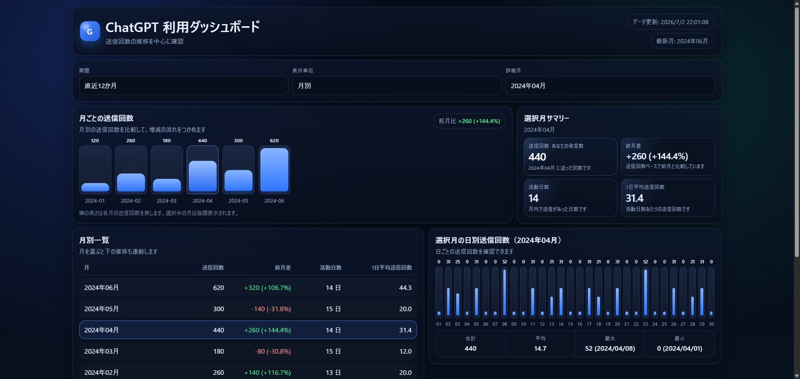
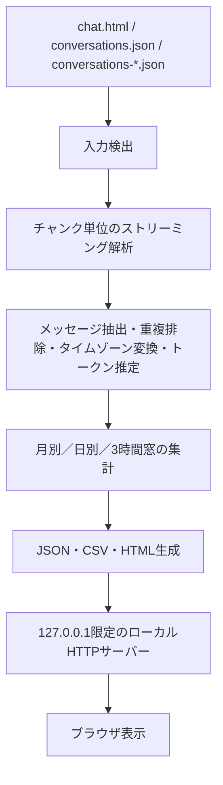

# ChatGPT Export Usage Dashboard

ChatGPT のエクスポートを、外部送信せずにローカルで集計する小さな Windows 向けツールです。月別・日別の送信数、推定トークン数、連続3時間の送信数候補を HTML / JSON / CSV として生成します。



公開デモ: [GitHub Pages の合成データ版](https://misaka310.github.io/chatgpt_chat_view/)（Pages を有効化後に利用可能）。スクリーンショットとデモは合成データのみを使用しています。

## できること

- `chat.html`、`conversations.json`、または `conversations-*.json` を検出して解析する
- チャンク単位で JSON 配列を読み、重複メッセージを除外してローカル時刻へ変換する
- 月別・日別・連続3時間窓の集計を作り、ローカルのダッシュボードで確認する

## 構成



## 必要環境

- OS: Windows 11 で検証済み。他の OS は未検証です。
- Python: 3.11.9 で検証済み。`setup.bat` は仮想環境を作成します。
- ブラウザ: `fetch` と ES2017 を実装したデスクトップブラウザが必要です。特定ブラウザでの描画E2E検証は未実施です。
- Git は必須ではありません。GitHub の **Download ZIP** を展開しても利用できます。
- インターネット接続は、初回の `pip install -r requirements.txt` と GitHub Pages デモの閲覧時だけ必要です。解析中は不要です。
- 解析対象、生成 JSON / CSV / HTML はローカルに保存されます。GPU、外部 API、アカウントは不要です。

## 使い方

```powershell
git clone https://github.com/misaka310/chatgpt_chat_view.git
cd chatgpt_chat_view
.\setup.bat
```

`input/` に、次のいずれかを1種類置きます。

```text
input/chat.html
input/conversations.json
input/conversations-*.json
```

次に解析と表示を行います。

```powershell
.\run_analyze.bat
.\run_front.bat
```

表示URLは通常 `http://127.0.0.1:8733/dashboard.html` です。ダッシュボードと `gpt_3h_limit.html` は相互に移動できます。

## 制限事項

- **3時間160送信**は公式の利用量ではなく、エクスポート中の `author.role == user` を数えた推定値です。
- モデル別の利用量、Thinking、添付、ツール利用などは正確に分離できません。
- トークン数は `tiktoken` による推定で、利用できない場合は文字数ベースのフォールバック推定です。
- ChatGPT のエクスポート形式が変わると、入力を読めなくなる可能性があります。
- 対応入力形式は上記の `chat.html`、単一の `conversations.json`、分割された `conversations-*.json` です。
- ダッシュボードはローカル表示用の生成物です。インターネット上のサービスではありません。
- 生成された HTML / JSON / CSV には会話タイトルなど、エクスポート由来の情報が残る場合があります。共有前に内容を確認してください。

## 合成データの静的デモ

`scripts/build_sample_output.py` は決定的な合成会話を作り、解析処理そのものを通して静的デモを生成します。実際のユーザーエクスポートは使用しません。

```powershell
python scripts/build_sample_output.py --output-dir .demo-build --publish-dir .demo-pages
```

`.demo-pages/` には `index.html`、`dashboard.html`、`gpt_3h_limit.html` と表示に必要な2つの JSON だけが置かれます。入力用 `conversations.json` や解析途中ファイルは公開物に含まれません。

GitHub Pages は `.github/workflows/pages.yml` で Actions artifact としてデプロイします。リポジトリの **Settings → Pages → Build and deployment → Source** を **GitHub Actions** に一度設定してください。初回実行後の URL は `https://misaka310.github.io/chatgpt_chat_view/` です。

## 大規模入力ベンチマーク

決定的な合成データだけを一時ディレクトリに生成して計測します。生成データはリポジトリに残りません。

```powershell
python scripts/benchmark_large_export.py --messages 100000 --report-file .\benchmark-result.json
```

結果と条件は [docs/BENCHMARKS.md](docs/BENCHMARKS.md) に記録しています。`tracemalloc` のピークは Python が追跡できた割り当てであり、OS 全体の RSS ではありません。

## 依存関係

直接依存の `tiktoken` は、検証済みの `0.13.0` に固定しています。小規模ツールのため lockfile を増やさず、更新時は `requirements.txt` の版を更新して CI とローカルテストを通します。`tiktoken` の読み込みに失敗した場合も、既存の文字数ベース推定で解析は継続します。

## テスト

```powershell
python -m unittest
python scripts/build_sample_output.py
python scripts/benchmark_large_export.py --messages 100 --report-file .\benchmark-smoke.json
```

CI は実エクスポート、秘密情報、外部 API を使いません。データの取り扱いは [PRIVACY.md](PRIVACY.md)、脆弱性報告と安全上の注意は [SECURITY.md](SECURITY.md) を参照してください。

## ライセンス

MIT
